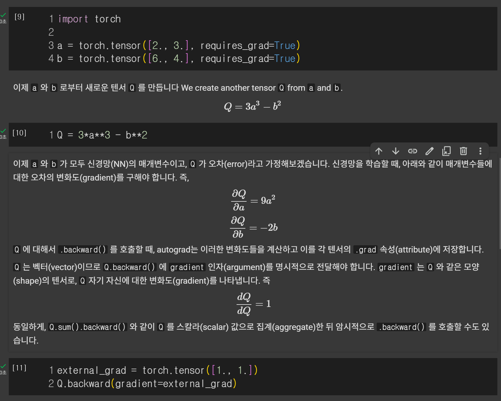

# `torch.autograd` 정리

## 신경망 학습 과정

신경망 학습은 두 단계로 이루어진다.

1.  **순전파 (Forward Propagation)**
    * 입력 데이터를 모델에 통과시켜 예측값을 출력한다.
    * `prediction = model(data)`

2.  **역전파 (Backward Propagation)**
    * 예측값과 실제 정답(label) 간의 **오차(loss)를 계산**한다.
    * 이 오차를 기반으로 모델의 각 매개변수(가중치, 편향)가 오차에 얼마나 영향을 미치는지 **미분값(gradient)을 계산**한다.
    * `loss.backward()`를 호출하여 이 과정을 시작한다.
    * 계산된 변화도를 이용해 **옵티마이저(optimizer)가 매개변수를 업데이트**하여 오차를 줄여나간다 (`optim.step()`).

## 옵티마이저란?
옵티마이저(Optimizer)는 딥러닝 모델의 손실 함수(Loss Function) 값을 최소화하도록 모델의 가중치(파라미터)를 업데이트하는 알고리즘이다. 
즉, 모델이 더 나은 예측을 하도록 훈련시키는 '조련사'와 같은 역할을 한다.

---

### 옵티마이저의 역할

신경망은 예측값과 실제값의 차이를 나타내는 '손실(loss)'을 계산한다. 옵티마이저의 목표는 이 손실을 가장 작게 만드는 것이며, 이 과정은 다음과 같이 이루어진다.

* **Gradient 계산**: 현재 가중치에서 손실을 가장 빠르게 줄일 수 있는 방향과 크기, 즉 **기울기(gradient)**를 계산한다. 이는 손실 함수를 각 가중치로 미분하여 구한다.
* **가중치 업데이트**: 계산된 기울기 방향으로 모델의 가중치를 조금씩 이동시킨다. 이때 얼마나 많이 이동할지를 결정하는 것이 **학습률(learning rate)**이다.
* **반복**: 이 과정을 계속 반복하면서 손실이 최솟값에 도달할 때까지 모델을 점진적으로 개선한다.

`가중치(업데이트) = 기존 가중치 - (학습률 × 기울기)`

---

### 옵티마이저의 종류

다양한 종류의 옵티마이저가 있으며, 각각 다른 방식으로 가중치를 업데이트한다.

* **SGD (Stochastic Gradient Descent)**: 가장 기본적인 옵티마이저로, 계산된 기울기 방향으로 가중치를 업데이트한다.
* **Adam (Adaptive Moment Estimation)**: 각 파라미터마다 학습률을 다르게 조절하여 효율적이고 빠르게 최적점에 도달하는 경향이 있어 현재 가장 널리 사용되는 옵티마이저 중 하나이다.
* **RMSprop**: Adam과 유사하게 각 파라미터마다 학습률을 조정하지만, 다른 방식을 사용한다.

어떤 옵티마이저를 선택하는지에 따라 모델의 훈련 속도와 성능이 달라질 수 있기 때문에, 문제의 특성에 맞는 옵티마이저를 선택하는 것이 중요하다.
---

## `autograd`의 동작 원리

`autograd`는 텐서의 모든 연산을 추적하여 계산 그래프(Computational Graph, DAG)를 만든다.

###  Computational Graph란? -> 그래프를 가지고 계산을 함! 
Computational Graph(계산 그래프)는 딥러닝 모델의 계산 과정을 그래프 형태로 표현한 것이다. 복잡한 연산을 노드(node)와 엣지(edge)의 연결로 시각화하여, 데이터의 흐름과 연산 단계를 명확하게 보여준다.

- 딥러닝 프레임워크인 PyTorch나 TensorFlow의 핵심적인 동작 원리

계산 그래프의 구성 요소
- 노드 (Node): 데이터(텐서, 벡터, 변수) 또는 수학적 연산(덧셈, 곱셈, 활성화 함수 등)을 나타낸다.

- 엣지 (Edge): 노드 간의 데이터 흐름을 나타내는 방향성이 있는 선입니다. 엣지는 한 노드의 출력값이 다른 노드의 입력값으로 어떻게 전달되는지를 보여준다.

예를 들어, $z = (x + y) * w$ 라는 수식은 아래와 같은 계산 그래프로 표현할 수 있다.
1. x와 y 노드가 +(덧셈) 노드로 연결됩니다.
2. 덧셈 노드의 결과와 w 노드가 *(곱셈) 노드로 연결되어 최종 결과 z를 만듭니다.


* **`requires_grad=True`**: 텐서에 이 속성을 설정하면, 해당 텐서와 관련된 모든 연산이 그래프에 기록된다. 신경망의 학습 가능한 매개변수들은 기본적으로 이 값이 `True`로 설정된다.
* **`.backward()`**: 그래프의 최종 결과(주로 loss)에서 이 함수를 호출하면, 그래프를 따라 역방향으로 이동하며 각 매개변수에 대한 미분값을 자동으로 계산한다.
* **`.grad`**: 계산된 미분값은 각 텐서의 `.grad` 속성에 저장된다.



1. 텐서 a, b - parameter
2. a와 b를 가지고 새로운 텐서 Q - error
NN을 학습할 때 a, b가 얼마나 변했는지 미분해서 구해야함 -> autograd는 여기서 변화를 계산해서 .grad(속성)에 저장함

- Q 는 벡터(vector)이므로 Q.backward() 에 gradient 인자(argument)를 명시적으로 전달해야 합니다.?

---

### 미분 계산에서 제외하는 방법

학습 과정에서 특정 매개변수의 업데이트를 원하지 않을 때 (예: 사전 학습된 모델 미세조정 시), 해당 파라미터를 **고정(freeze)**할 수 있다. 이렇게 하면 불필요한 연산을 줄여 성능을 높일 수 있다.

* **`param.requires_grad = False`**: 특정 매개변수의 추적을 중단시켜 미분 계산에서 제외한다.
* **`with torch.no_grad():`**: 이 컨텍스트 블록 내의 모든 연산은 미분값을 계산하거나 추적하지 않는다. 이는 평가(inference) 시에 유용하다.


야코비안 행렬(Jacobian Matrix)은 **다변수 벡터 함수를 각 변수로 편미분한 결과를 행렬로 나타낸 것**이다. 간단히 말해, 여러 개의 변수를 입력받아 여러 개의 결과를 출력하는 복잡한 함수의 '도함수' 역할을 한다.

이 행렬은 특정 지점에서 함수가 각 입력 변수의 변화에 따라 어떻게 변하는지를 한 번에 보여주는 **linear approximation**를 나타낸다.

---

## 야코비안 행렬의 형태

함수 $f: \mathbb{R}^n \rightarrow \mathbb{R}^m$ 가 n개의 변수($x_1, ..., x_n$)를 입력받아 m개의 결과($f_1, ..., f_m$)를 출력할 때, 야코비안 행렬 $J$는 다음과 같이 $m \times n$ 크기의 행렬로 표현된다.

$$
J =
\begin{pmatrix}
 \frac{\partial f_1}{\partial x_1} & \cdots & \frac{\partial f_1}{\partial x_n} \\
 \vdots & \ddots & \vdots \\
 \frac{\partial f_m}{\partial x_1} & \cdots & \frac{\partial f_m}{\partial x_n}
\end{pmatrix}
$$

각 행은 하나의 출력 함수를 모든 입력 변수로 편미분한 결과를 나타내고, 각 열은 모든 출력 함수를 하나의 입력 변수로 편미분한 결과를 보여준다.

---

## 딥러닝에서의 역할과 중요성 -> AutoGrad에서 활용

야코비안 행렬은 특히 딥러닝 모델의 학습 과정에서 핵심적인 개념이다.

* **역전파 (Backpropagation)**: 신경망에서 출력층의 손실(loss)이 입력층의 가중치(weights)에 어떤 영향을 미치는지 계산할 때 야코비안 행렬의 개념이 사용된다. 역전파 알고리즘은 본질적으로 야코비안 행렬과 특정 벡터를 곱하는 연산(**벡터-야코비안 곱, Vector-Jacobian Product**)을 효율적으로 수행하여, 각 가중치에 대한 기울기(gradient)를 계산하고 모델을 업데이트한다.

* **민감도 분석**: 모델의 출력이 입력의 작은 변화에 얼마나 민감하게 반응하는지 분석하는 데 사용된다. 예를 들어, 이미지 분류 모델에서 입력 이미지의 특정 픽셀 값이 변할 때 최종 예측 확률이 얼마나 변하는지 야코비안을 통해 파악할 수 있다.

* **모델 안정성**: 순환 신경망(RNN)과 같은 모델에서 기울기가 폭발하거나 소실되는(exploding/vanishing gradients) 문제를 분석하고 이해하는 데 중요한 이론적 기반이 된다.


# 그럼 computational graph가 야코비안 행렬의 계산을 반영하는건가?

정확히 말하면, 계산 그래프는 야코비안 행렬 그 자체를 보여주는 것이 아니라, **야코비안을 이용한 계산(특히, 벡터-야코비안 곱)을 효율적으로 수행하기 위한 '설계도'** 역할을 한다.

둘의 관계를 쉽게 이해하기 위해, 왜 딥러닝에서 전체 야코비안 행렬을 직접 계산하지 않는지부터 알아야 한다.

---

### 문제: 왜 전체 야코비안 행렬을 계산하지 않는가?

딥러닝 모델은 수백만 개가 넘는 파라미터(입력)를 가지고, 여러 개의 값(출력)을 계산한다. 만약 이 전체 함수의 야코비안 행렬을 직접 만들려고 하면 다음과 같은 문제가 발생한다.

* **메모리 폭발**: 행렬의 크기가 어마어마하게 커져서 메모리에 모두 저장하는 것 자체가 불가능에 가깝다.
* **계산 비효율**: 이 거대한 행렬을 만들고, 또 다른 행렬과 곱하는 연산은 엄청난 계산 낭비를 초래한다.

딥러닝에서는 사실 이 거대한 야코비안 행렬 전체가 필요한 것이 아니라, **최종 손실(loss)에 대한 각 파라미터의 기울기(gradient)만 필요**하다.

---

### 해결책: 계산 그래프와 벡터-야코비안 곱

이 문제를 해결하기 위해 딥러닝 프레임워크는 다음과 같은 영리한 방법을 사용한다.

1.  **계산을 잘게 쪼갠다 (계산 그래프)**: 전체 신경망이라는 거대한 함수를 덧셈, 곱셈, 활성화 함수 등 아주 간단한 연산들의 연속으로 쪼개어 그래프로 만든다. 각 연산(노드)은 자신만의 아주 작은 '지역(local) 야코비안'을 가진다.

2.  **연쇄 법칙(Chain Rule)을 적용한다**: 미분의 연쇄 법칙을 이용하면, 이 작은 지역 야코비안들을 차례대로 곱해서 최종 기울기를 구할 수 있다. 계산 그래프는 이 연쇄 법칙을 적용하기에 완벽한 구조이다.

3.  **핵심 기술: 벡터-야코비안 곱 (Vector-Jacobian Product, VJP)**: 역전파 과정에서는 거대한 야코비안 행렬을 통째로 만들지 않는다. 대신, **뒷단(downstream)에서 넘어온 기울기(벡터)와 현재 노드의 지역 야코비안을 곱하는 연산(VJP)**을 수행한다. 이 계산 결과가 바로 앞단(upstream)으로 넘겨줄 새로운 기울기 벡터가 된다.

이 VJP 연산을 그래프의 끝에서부터 시작점까지 연쇄적으로 반복하면, 결국 우리가 원했던 '최종 손실에 대한 각 파라미터의 기울기'를 매우 효율적으로 얻을 수 있다.

---

### 결론

* **계산 그래프**: 복잡한 함수의 계산 흐름을 보여주는 **설계도**이다.
* **야코비안 행렬**: 각 지점에서 입력 변화에 따른 출력 변화율을 나타내는 **이론적 도구**이다.
* **역전파 (in Autograd)**: 계산 그래프라는 설계도를 따라, 야코비안 행렬을 직접 만들지 않고 **벡터-야코비안 곱(VJP)이라는 효율적인 연산을 연쇄적으로 수행**하여 최종 기울기를 계산하는 과정이다.

따라서, **계산 그래프는 야코비안 행렬의 개념을 딥러닝에 효율적으로 적용하기 위한 핵심적인 구조**라고 할 수 있다. 마치 도미노를 세워놓고(계산 그래프 생성) 맨 끝을 톡 건드리면(역전파 시작) 연쇄적으로 쓰러지며(VJP 연산) 힘이 전달되는 것과 같다.


# `no_grad`가 학습이 아닌 inference에서 사용되는 이유
생각해보면 당연하다. 추론은 학습시킨 모델을 가지고 결과만 구하면 되기 때문에 backward prop이 필요 없기 때문이다.


추론(inference) 시 `torch.no_grad()`를 사용하는 이유는 **불필요한 연산을 막아 속도를 높이고 메모리 사용량을 줄이기 위함이다.**

추론 시에는 모델의 가중치를 업데이트할 필요가 없으므로, 기울기(gradient)를 계산하고 추적하는 모든 과정이 낭비이다. `torch.no_grad()`는 이러한 낭비를 막는 스위치 역할을 한다.

-----

## 왜 `no_grad`를 사용하는가?

1.  **성능 향상 및 메모리 절약 🚀**

      * **`grad` 추적 시**: PyTorch는 역전파(backward pass)를 위해 모든 연산 과정을 계산 그래프(Computational Graph)에 기록한다. 어떤 연산이 수행되었는지, 중간값은 무엇인지 등을 저장해야 하므로 추가적인 메모리와 연산 시간이 소모된다.
      * **`no_grad` 사용 시**: 계산 그래프를 전혀 생성하지 않는다. 그냥 단순한 순전파(forward pass) 연산만 수행한다. 이로 인해 코드 실행 속도가 훨씬 빨라지고 메모리 사용량도 크게 줄어든다.

2.  **일관성 및 안정성**

      * `with torch.no_grad():` 블록은 "이 안에서는 절대 기울기를 계산하지 않는다"는 의도를 코드에 명확히 표현한다.
      * 실수로라도 추론 과정에서 `.backward()`가 호출되는 등의 오류를 방지하는 효과도 있다.

-----

## 추론 시 무조건 사용해야 하는가?

**코드가 동작하는 데 필수는 아니지만, 사실상 필수(de facto standard)로 사용한다.**

`torch.no_grad()` 없이 추론 코드를 실행해도 모델이 예측하는 **결괏값 자체는 동일하다.** 하지만 위에서 설명한 속도 저하와 메모리 낭비가 발생하기 때문에, 학습이 아닌 순수한 예측(추론)을 하는 모든 상황에서는 `torch.no_grad()`를 사용하는 것이 표준적인 관행(best practice)이다.

#### 간단한 예시

```python
import torch
import torch.nn as nn

# 간단한 모델과 입력 데이터
model = nn.Linear(10, 2)
input_data = torch.randn(1, 10)

# 1. grad를 추적하는 경우 (비효율적)
output_with_grad = model(input_data)
print(f"With grad: requires_grad={output_with_grad.requires_grad}, grad_fn={output_with_grad.grad_fn}")
# 결과: With grad: requires_grad=True, grad_fn=<AddmmBackward0 object at ...>
# requires_grad가 True이며, 역전파를 위한 grad_fn이 존재한다.

# 2. no_grad를 사용하는 경우 (효율적)
with torch.no_grad():
    output_no_grad = model(input_data)
    print(f"No grad:   requires_grad={output_no_grad.requires_grad}, grad_fn={output_no_grad.grad_fn}")
# 결과: No grad:   requires_grad=False, grad_fn=None
# requires_grad가 False이며, grad_fn도 없어 메모리와 연산이 절약된다.
```