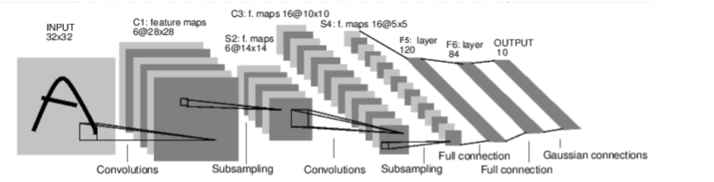
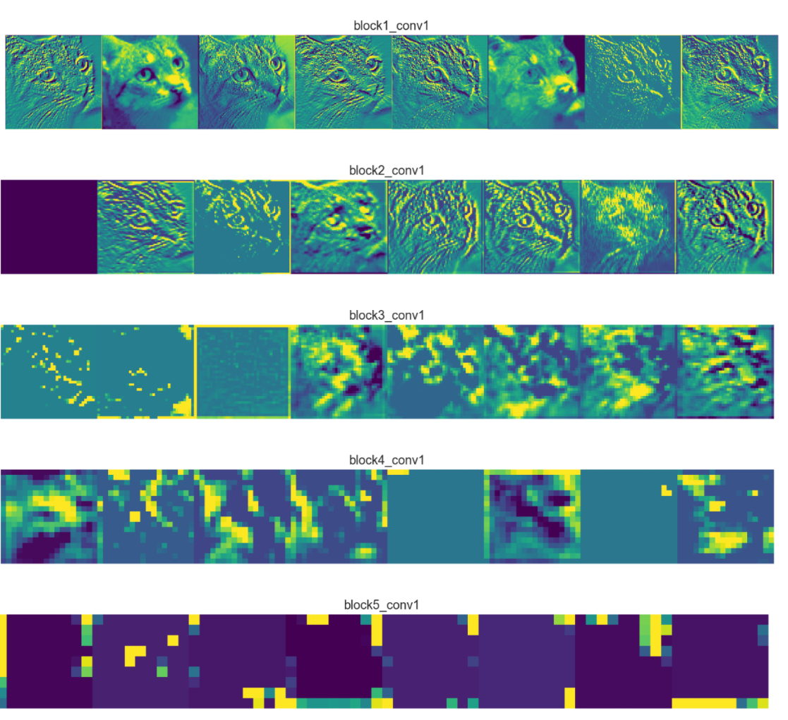

## 신경망 개요

신경망은 `torch.nn` 패키지를 통해 정의하며, `nn.Module`을 상속받아 계층과 forward 연산을 정의한다. 미분은 `autograd`가 자동으로 수행한다.

---

### 신경망 학습 흐름

1. 학습 가능한 매개변수를 가진 신경망을 정의한다.
2. 데이터를 반복적으로 입력한다.
3. 입력을 신경망에 전달하여 출력을 얻는다.
4. 출력과 정답을 비교하여 손실(loss)을 계산한다.
5. 손실에 대해 역전파(backpropagation)한다.
6. 변화도를 바탕으로 가중치를 갱신한다.

   * 새로운 가중치(weight) = 가중치(weight) - 학습률(learning rate) * 변화도(gradient)

   - learning rate는 내가 조절

---

### 신경망 구조 예시



```python
class Net(nn.Module):
    def __init__(self):
        super(Net, self).__init__()
        self.conv1 = nn.Conv2d(1, 6, 5) # 채널이 1개인 입력(ex. 흑백이미지)을 받아 6개의 5X5 필터를 적용하여 6개의 feature map을 출력하는 layer -> 다음 layer가 이 6개 feature 받아야함
        # 1채널 이미지 -> 6채널
        self.conv2 = nn.Conv2d(6, 16, 5)
        self.fc1 = nn.Linear(16*5*5, 120)
        self.fc2 = nn.Linear(120, 84)
        self.fc3 = nn.Linear(84, 10)

    def forward(self, x):
        x = F.max_pool2d(F.relu(self.conv1(x)), 2)
        x = F.max_pool2d(F.relu(self.conv2(x)), 2)
        x = torch.flatten(x, 1)
        x = F.relu(self.fc1(x))
        x = F.relu(self.fc2(x))
        x = self.fc3(x)
        return x
```
- output 
```
Net(
  (conv1): Conv2d(1, 6, kernel_size=(5, 5), stride=(1, 1))
  (conv2): Conv2d(6, 16, kernel_size=(5, 5), stride=(1, 1))
  (fc1): Linear(in_features=400, out_features=120, bias=True)
  (fc2): Linear(in_features=120, out_features=84, bias=True)
  (fc3): Linear(in_features=84, out_features=10, bias=True)
)
```

### feature map이란?(Activation map)
피처 맵(Feature Map)은 **필터(Filter)가 원본 이미지를 훑고 지나가면서 찾아낸 특정 특징(Feature)을 시각적으로 보여주는 결과물**이라고 생각하시면 됩니다. 활성화 맵(Activation Map)이라고도 부릅니다.

조금 더 쉽게 비유해 보겠습니다.


-----

### 돋보기 비유 🔎

여기에 여러 가지 모양이 그려진 그림(입력 이미지)이 있다고 상상해 보세요.

1.  **필터(Filter) = 특별한 돋보기**:

      * '세로선만 보여주는 돋보기'가 있다고 해봅시다. 이 돋보기가 바로 **필터**입니다.
      * 다른 돋보기는 '가로선만', 또 다른 돋보기는 '동그라미만' 보여줄 수 있습니다. CNN에서는 이런 특징을 감지하는 필터가 여러 개 있습니다. 

2.  **피처 맵(Feature Map) = 돋보기로 본 결과**:

      * '세로선 돋보기'(필터)를 들고 원본 그림 위를 쭉 훑어봅니다.
      * 그림에서 **세로선이 있는 부분은 밝게 빛나고, 없는 부분은 어둡게 보이는 새로운 그림**이 만들어집니다.
      * 바로 이 '돋보기로 본 결과물'이 **피처 맵**입니다. 즉, "원본 이미지에서 세로선이라는 특징(Feature)이 어디에 강하게 나타나는지(Map)"를 보여주는 지도인 셈입니다. -> 약간 영상처리 필터 그런느낌..?

-----

### `nn.Conv2d(1, 6, 5)` 예시와 연결

이전 질문에서 `out_channels=6`은 6개의 필터를 사용한다는 의미라고 설명드렸습니다.

  * 이 6개의 필터는 각각 다른 특징을 찾도록 학습됩니다.

      * **필터 1**: 수직선을 찾는 돋보기
      * **필터 2**: 수평선을 찾는 돋보기
      * **필터 3**: 둥근 모서리를 찾는 돋보기
      * **필터 4**: 특정 질감을 찾는 돋보기
      * ... 등등

  * 따라서 입력 이미지 하나가 이 레이어를 통과하면, **각 필터마다 하나씩, 총 6개의 피처 맵**이 출력됩니다.

      * **피처 맵 1**: "수직선이 어디에 있는지"를 나타내는 지도
      * **피처 맵 2**: "수평선이 어디에 있는지"를 나타내는 지도
      * **피처 맵 3**: "둥근 모서리가 어디에 있는지"를 나타내는 지도
      * ... 이렇게 6개가 생성됩니다.

### 요약

피처 맵(Feature Map)이란?

> **하나의 필터(Filter)가 이미지 전체를 스캔하며, 자기가 맡은 특징이 이미지의 어느 부분에 존재하는지를 표시한 결과물**입니다.

신경망은 이렇게 생성된 여러 종류의 피처 맵(수직선, 곡선, 질감 등)을 종합적으로 보고 "아, 이 이미지에는 눈과 코, 뾰족한 귀 모양의 특징들이 있으니 고양이일 확률이 높겠군\!" 하고 판단하게 되는 것입니다.

---

###  모델 사용 예시

```python
net = Net()
input = torch.randn(1, 1, 32, 32)
output = net(input)
```

모델의 파라미터는 `net.parameters()`로 접근한다.

---

### 손실 함수 (Loss Function)

```python
criterion = nn.MSELoss()
loss = criterion(output, target)
```

`.grad_fn`으로 연산 그래프를 추적할 수 있다.
`loss.backward()`를 호출하면 역전파가 수행되며 `.grad`에 변화도가 누적된다.

---

### 가중치 갱신 (Gradient Descent)

#### 수동 갱신:

```python
learning_rate = 0.01
for param in net.parameters():
    param.data.sub_(learning_rate * param.grad.data) # Gradient Descent 직접
```

#### Optimizer 사용:

```python
import torch.optim as optim
optimizer = optim.SGD(net.parameters(), lr=0.01)

optimizer.zero_grad()
output = net(input)
loss = criterion(output, target)
loss.backward()
optimizer.step()
```

---

### 정리

| 개념                  | 설명                                       |
| ------------------- | ---------------------------------------- |
| `torch.Tensor`      | 자동 미분을 지원하는 다차원 배열이다.                    |
| `nn.Module`         | 신경망 계층의 기본 단위이며, 파라미터 관리 및 GPU 전송을 지원한다. |
| `nn.Parameter`      | `Module`에 등록되는 학습 가능한 파라미터이다.            |
| `autograd.Function` | 순방향 및 역방향 연산을 정의하며, 연산 그래프를 구성한다.        |

